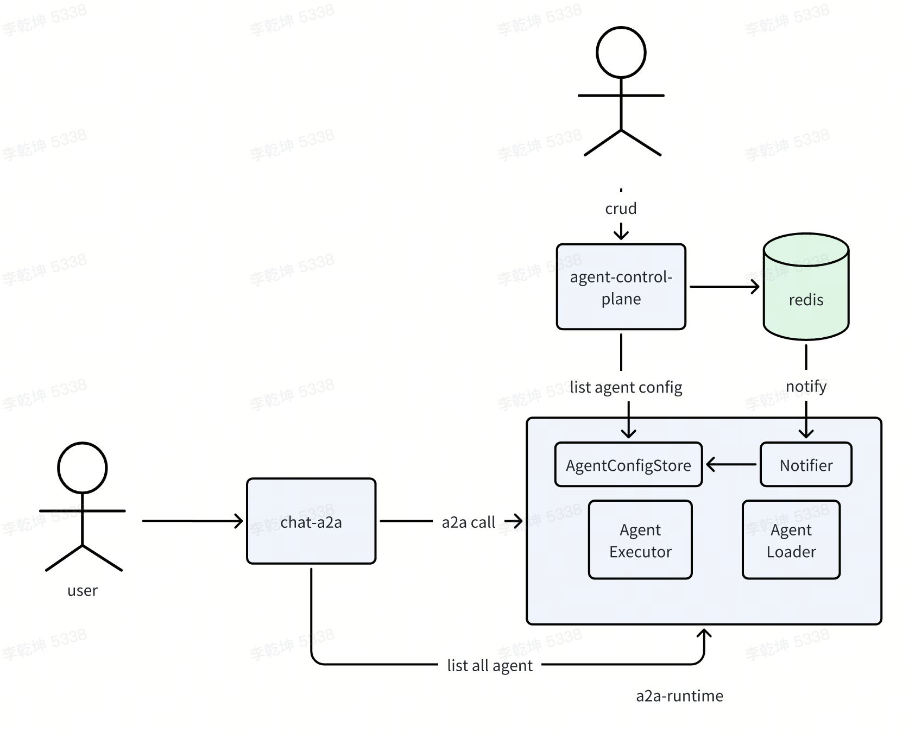

# 简介

a2a-runtime 是一个支持a2a协议的agent 容器，用户可以在agent 包下实现自己的agent（不限制框架），多个agent以a2a协议暴漏在特定endpoint下。

比如用户实现了两个agent，分别是agent1和agent2，同属于一个namespace下（比如default），则
```
# 访问agent1 rpc url
http://a2a-runtime:port/default/agent1

# 访问agent2 rpc url
http://a2a-runtime:port/default/agent2
```



建议与[chat-a2a](https://github.com/qiankunli/chat-a2a) 配合使用

# 系统内置Agent示例

系统目前包含三个内置agent，均注册在default namespace下：

## 1. Hello World Agent

- **功能**: 简单的问候语生成agent (Demo)
- **描述**: Just a hello world agent
- **访问端点**: `http://localhost:9999/default/helloworld`
- **输入模式**: text
- **输出模式**: text
- **特性**: 流式输出支持

## 2. Weather Agent

- **功能**: 天气查询agent (Demo)
- **描述**: Helps with weather
- **访问端点**: `http://localhost:9999/default/weather`
- **输入模式**: text
- **输出模式**: text
- **特性**: 仅支持上海天气查询，如输入不含"上海"会提示"你问哪里的天气"

## 3. Travel Planner Agent

- **功能**: 旅游规划agent (Demo)，提供北京旅游路线建议
- **描述**: travel planner
- **访问端点**: `http://localhost:9999/default/travel`
- **输入模式**: text
- **输出模式**: text
- **特性**: 三步式旅游路线（故宫→长城→颐和园）

## Agent注册机制

所有agent通过以下方式注册：

1. **配置注册**: 在`main.py`中的`init_agent_config_store()`函数配置AgentCard
2. **实例化注册**: 在`server/loader/default.py`中通过`DefaultAgentLoader`实例化
3. **路由暴露**: 通过`RuntimeAgentExecutor`和`RuntimeA2AFastAPIApplication`暴露为REST API

添加新agent时，需要在以上三个位置进行相应配置。

# 改动

对a2a-python 一些现有实现的改动放在server.a2a2 包下
1. 提供一个入口RuntimeAgentExecutor，将收到的请求转发给具体的a2a AgentExecutor
2. 提供一个新的RuntimeA2AFastAPIApplication（仿自eA2AFastAPIApplication）将不同agent 挂在到同一个endpoint（不同path）下

# 运行

```
# 安装依赖
poetry install

# 运行
poetry run python -m main
# 或在配置venv 后运行
python main.py
```
# 联系我

项目仍不完善，欢迎共创

